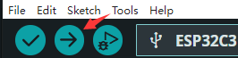
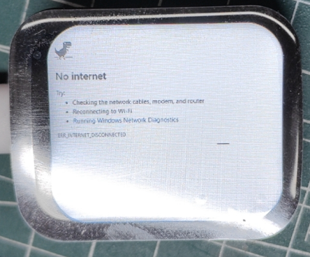

<h1 align = "center"> ❤ESP32-C3 1.69inch Round LCD  TouchScreen ST7789 LVGL Astronaut weather Clock Watch MINITV Buzzer
 ❤</h1>

## 】For complete information please see:[ESP32-C3-1.69inch LCD ST7789 User Guide](https://spotpear.com/wiki/ESP32-C3-Ornament-Trinket-LVGL-Astronaut-Clock-Watch-MINI-TV-1.69inch-Round-LCD-TouchScreen-ST7789-240x280.html)

## 】Description

This desktop gadget, based on ESP32 C3, is not only a practical mini-TV but also a unique design artwork.
Its 1.69inch LCD screen, driven by ST7789, can run small and short videos with LVGL drive.
Additionally, it can connect to WiFi to display the current weather and time, providing convenience in your daily life.
Its distinctive design allows it to be not just a desktop decoration but also a portable pendant,
allowing you to showcase your personality and taste whether you are on the subway or on the street.

## 1️】Support Product

| Product (PinMap)        --------   |    SOC     | Flash |  Resolution | Size      |
| --------------------------------   | ---------- | ----- | ----------- | --------- |
| [ESP32 C3 1.69inch-NO-Touch][1]    |  ESP32-C3  | 16MB  |   240x280   | 1.69 Inch |
| [ESP32 C3 1.69inch-Touch][2]       |  ESP32-C3  | 16MB  |   240x280   | 1.69 Inch |
| [ESP32 C3 1.69inch-Touch-Case][3]  |  ESP32-C3  | 16MB  |   240x280   | 1.69 Inch |
| [ESP32 C3 1.69inch-Touch-BatBox][4]|  ESP32-C3  | 16MB  |   240x280   | 1.69 Inch |

[1]:https://spotpear.com/shop/ESP32-C3-Ornament-Trinket-LVGL-Astronaut-Clock-Watch-MINI-TV-1.69inch-Round-LCD-TouchScreen-ST7789-240x280/ESP32-C3-1.69inch-LCD-No-Touch.html
[2]:https://spotpear.com/shop/ESP32-C3-Ornament-Trinket-LVGL-Astronaut-Clock-Watch-MINI-TV-1.69inch-Round-LCD-TouchScreen-ST7789-240x280/ESP32-C3-1.69inch-LCD-Touch.html
[3]:https://spotpear.com/shop/ESP32-C3-Ornament-Trinket-LVGL-Astronaut-Clock-Watch-MINI-TV-1.69inch-Round-LCD-TouchScreen-ST7789-240x280-Case.html
[4]:https://spotpear.com/shop/ESP32-C3-Ornament-Trinket-LVGL-Astronaut-Clock-Watch-MINI-TV-1.69inch-Round-LCD-TouchScreen-ST7789-240x280-Case-BatBOX/ESP32-C3-1.69inch-LCD-Touch-Case-BatBOX-No-Battery.html

## 2️】Examples

```
./examples/
├── Animation                          #  Transient animation
├── Display-No touch version           #  Clock dial/Digital dial/Rotating Astronaut clock weather ornament
├── Display-Touch version              #  Clock dial/Digital dial/Rotating Astronaut clock weather ornament
├── Touch_PixelBit_Dino_Game_esp32     #  Click the screen to start Dinosaur game
├── No_Touch_PixelBit_Dino_Game_esp32  #  Press the "BOOT" button to start Dinosaur game
```
## 3】Arduino IDE Manual installation
1. Install [Arduino IDE](https://www.arduino.cc/en/software)
2. Install [Arduino ESP32 V 2.0.5 or above and below V2.0.13](https://docs.espressif.com/projects/arduino-esp32/en/latest/)
3. Download  , move to Arduino library folder (e.g. D:\Documents\Arduino\libraries)


attention:Open the Arduino IDE to see your library folder path
5. Copy all folders in lib folder to Arduino library folder (e.g. D:\Documents\Arduino\libraries)

6. Enter the downloaded `ESP32C3_1.69inch\examples` directory

7. Select any example and double-click the `mainapp.ino` to open it

8. Open ArduinoIDE ,`Tools` ，Make your selection according to the table below


9. Click `upload` , Wait for compilation and writing to complete


## 4】basic examples
**4.1】Clock dial/Digital dial/Rotating Astronaut clock weather ornament**
* 4.1.1】After opening the downloaded package, go to the ESP32C3_1.69inch\examples\Display-Touch version folder, open mainapp.ino, The touch version selected here (if the non-touch version, select Display-No touch version)
* 4.1.2】Once in the Arduino IDE, follow step 7 above to configure the ESP32C3 Tools
* 4.1.3】You can configure the WIFI hotspot information in the pin config.h file

* 4.1.4】Click `upload`
* 4.1.5】upload successful


* 4.1.6】Turn on the hotspot on the mobile phone, and set the hotspot information to the one configured in the pin_config.h file. In this case, set the hotspot information to the spotpear name and password: 12345678
* 4.1.7】Renderings, touch version: The screen swipes to switch dial. Non-touch version: The screen automatically switches the dial


**4.2】Dinosaur game**
* 4.2.1】**Go to the ESP32C3_1.69inch\examples\PixelBit_Dino_Game_esp32 folder and open the pixelbit_dino_game_ESP32.ino project
* 4.2.2】Click `upload`
* 4.2.3】Click the screen with your hand to start the game.



**4.3】Animated display**
* 4.3.1】Go to the libraries directory, open lv_conf.h file in the libraries folder and find "LV_COLOR_16_SWAP"


Change this to 0
* 4.3.2】Go to the ESP32C3_1.69inch\examples\Animation folder and open the Animation.ino project
* 4.3.3】Click `upload`
* 4.3.4】Renderings, with short animated displays and buzzer music


## 5】 FAQ
1. **Can't upload any sketch，Please enter the upload mode manually.**
   * Connect the board via the USB cable
   * Press and hold the **BOOT** button , While still pressing the **BOOT** button
   * Press **RST** button
   * Release the **RST** button
   * Release the **BOOT** button (If there is no **BOOT** button, disconnect IO0 from GND.)
   * Upload sketch
   * Press the **RST** button to exit download mode
